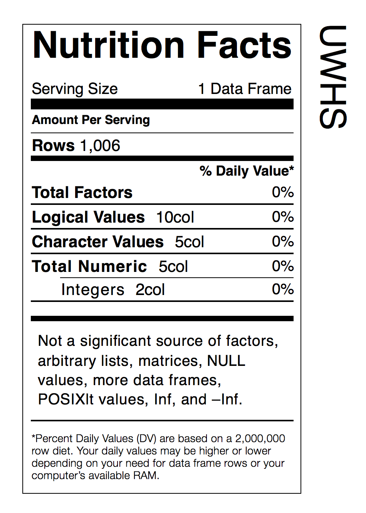

This is an **R** Dataset that contains information on the [**UNESCO World Heritage Sites**](http://whc.unesco.org/en/list/) (current as of the 2014 audit). There are 1006 sites included in the dataset with the following variables:

- _ref_no_  **UNESCO World Heritage Centre** reference numbers for heritage sites
- _name_  descriptive name of the world heritage site
- _date_inscribed_  year of inscription for the site
- _danger_list_  years that the heritage site was placed in the danger list
- _lon_, _lat_  the longitude and latitude values for the world heritage sites
- _area_hectares_  the area of the site in hectares
- _c1_, _c2_, _c3_, _c4_, _c5_, _c6_  boolean values that indicate which [cultural criteria](http://whc.unesco.org/en/criteria/) apply to the site
- _n7_, _n8_, _n9_, _n10_  boolean values that indicate which [natural criteria](http://whc.unesco.org/en/criteria/) apply to the site
- _category_  the designation of whether the heritage site is a `natural` site, a `cultural` site, or, a `mixed` site
- _country_iso_2_  a two-letter country code for which state the site resides; there are several sites that are trans-boundary sites, so this can consist of a space-separated list of two-letter country codes
- _unesco_region_  a **UNESCO**-defined global region

## Installation
This data-only package can be installed from **GitHub** with the **devtools** package:

```
devtools::install_github('rich-iannone/UWHS')
```

## Example Uses
It's a data frame called `uwhs`. Get the dimensions:
```
dim(uwhs)
#' [1] 1006   20
```

Find out how many sites are located or co-located in Germany. 
```
c(just_de = nrow(subset(uwhs, grepl("^de$", country_iso_2))),
  shared_with_de = abs(nrow(subset(uwhs, grepl("^de$", country_iso_2))) - 
                       nrow(subset(uwhs, grepl("de", country_iso_2)))))
#'       just_de shared_with_de 
#'            34              5 
```

Now go forth and explore these opulent sites that fulfil one (or many!) cultural and/or natural criteri(on|a)...
